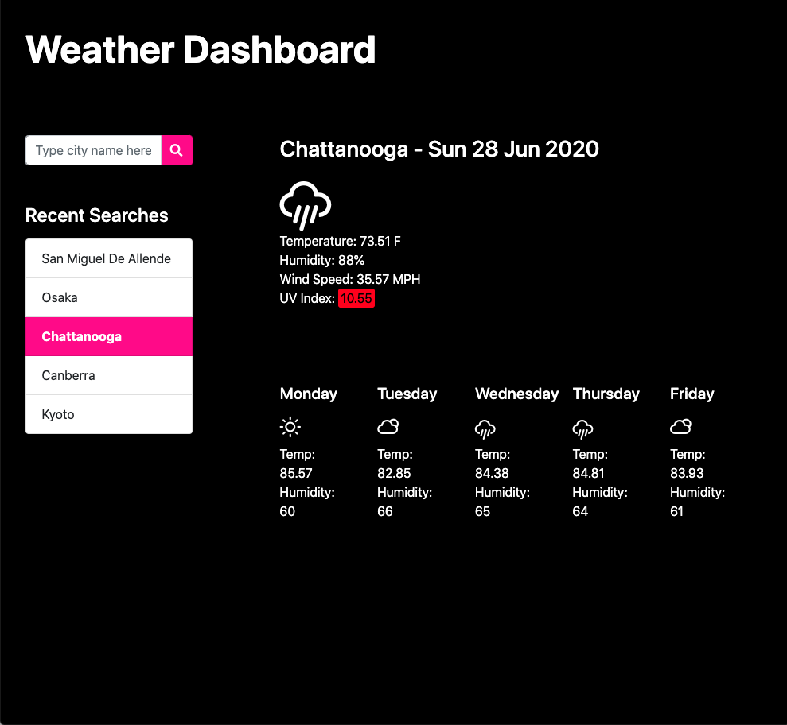

# Weather Dashboard

Welcome to the README for my sixth project as a student of Coding Boot Camp at UCLA Extension: The Weather Dashboard.

## Description

My sixth project is a weather dashboard: An application that allows the user to see the weather outlook for multiple cities. The user can search for a city and is presented with present and future weather conditions for that city, the city name, date, an icon representation of weather conditions, temperature, humidity, wind speed, and UV index (which is color-coded to note low, moderate, high, very high or extreme risk of harm). The city is also added to the search history. Future weather conditions are presented as a five-day forecast directly beneath the current weather conditions.  

## Link

[Weather Dashboard](https://seanc0ne.github.io/weather-dashboard/)

## Screenshot

